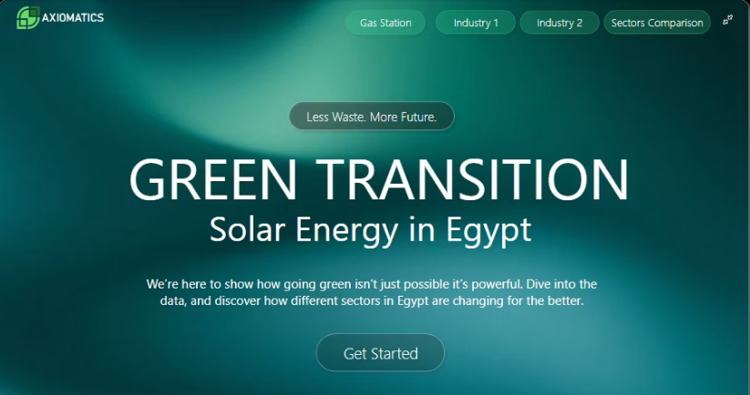
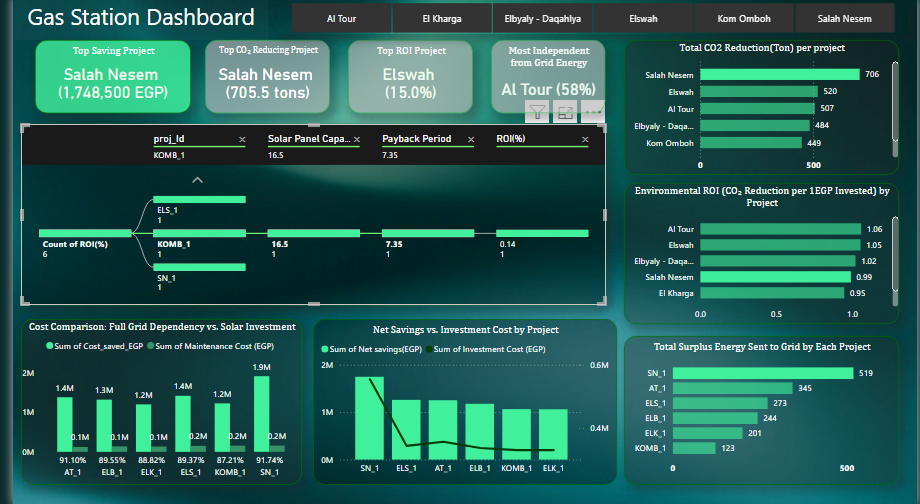
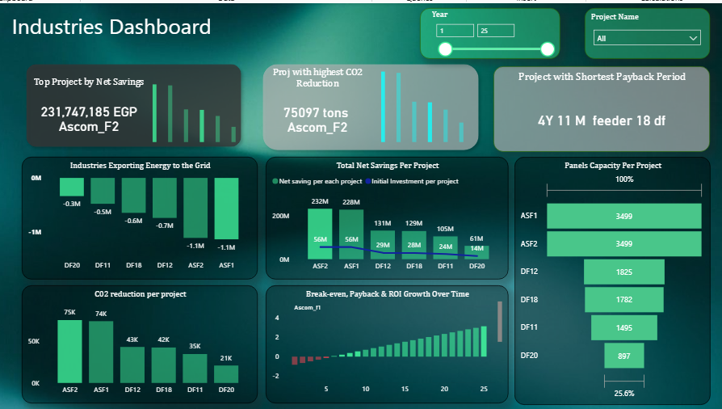
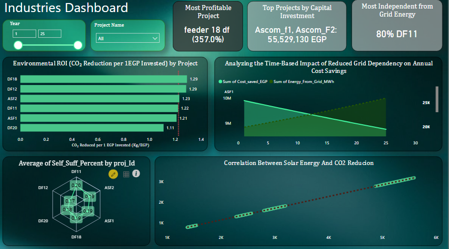
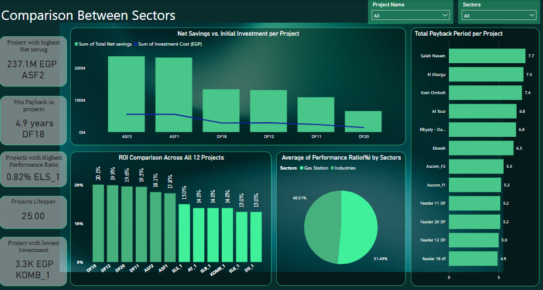

# ☀️ The Green Transition: Solar Energy in Egypt

## 🌍 Project Description

Egypt stands at the cusp of a green transformation. Despite abundant solar resources, many industrial and service sector establishments remain dependent on conventional energy sources. This project explores how the transition to **solar energy** can drive sustainability and profitability in Egypt's **industrial operations, service-based facilities, and agricultural sector**.

The primary objective of our study is to analyze the economic and environmental outcomes of adopting solar technology across a selection of real-life commercial, industrial, and agricultural sites — including factories, gas stations, and farms — over a 25-year period.

Our goal was to explore the real, measurable impact of **green technology** — specifically, **solar energy** — in different sectors across Egypt. We asked the big questions:  
- Does switching to solar really save money?  
- Is it worth the investment long-term?  
- How does it affect CO₂ emissions?  
- And which types of businesses benefit the most?

Using data from 15 different solar projects implemented over the last 25 years — ranging from massive industrial sites like **Dina Farms** and **ASCOM** to local **gas stations** and agricultural projects including **Alfalfa, Corn, Cotton, and Pomegranate farms** — we conducted a deep data analysis to uncover the financial and environmental results of going green.

This project is not just a technical case study — it's a **call to action**. The goal is to **raise awareness** and **encourage businesses in Egypt** to adopt renewable energy, showing them the concrete benefits through storytelling, data, and visualization. We want decision-makers, investors, and the public to see that solar is not just good for the planet — it's also smart business.

---

## 🎯 Project Goals

- 🔍 **Analyze the economic impact of solar energy**  
  Evaluate cost savings, ROI, and maintenance trends to understand profitability across different sites including agricultural applications.

- 🌱 **Quantify environmental benefits**  
  Measure CO₂ emissions reduction in both industrial and farming contexts, tracking its correlation with solar energy adoption.

- 📊 **Visualize insights for impact**  
  Build compelling dashboards with Power BI that include agricultural data, using visual storytelling to make data accessible to all.

- ⚡ **Showcase energy self-sufficiency**  
  Prove how relying more on solar boosts both financial and ecological outcomes across all sectors, including farming operations.

- 📣 **Inspire green adoption in Egypt's industry and agriculture**  
  Highlight success stories to motivate factories, gas stations, and farms to switch to renewable energy.

---

## 📚 Data Sources

We analyzed 25 years of real-world data from:
- 🏭 **Six factories** including Dina Farms and ASCOM  
- ⛽ **Six gas stations** including El Kharga, Kom Omboh, and Salah  
- 🌾 **Four agricultural projects** covering Alfalfa crops, Corn new lands, Cotton crops, and Pomegranate farms

Each project included values such as:
- `Produced_from_Solar_MWh`: Solar energy generated annually
- `Cost_saved_EGP`: Yearly cost savings from using solar
- `Maintenance_Cost_EGP`: Annual maintenance costs
- `Net_savings(EGP)`: Total financial savings after maintenance
- `Energy_From_Grid_MWh`: Electricity taken from the national grid
- `Total_Supplied_Elec_MWh`: Total electricity consumption
- `Self_Suff_Percent`: Solar dependency percentage
- `CO2_Reduction_tons`: Annual emissions avoided
- `ROI_Percent`: Return on investment

---

## 🌱 Agricultural Sector Insights

Our analysis of solar adoption in Egypt's agricultural sector reveals:

### Solar vs. Diesel Cost Comparison
- Traditional diesel irrigation costs reach **EGP 350,000/year** per farm
- Solar systems reduce energy costs by:
  - **48.5%** for Corn fields (Com_1)
  - **20.7%** for Pomegranate farms (PMG_1)
  - **63.3%** for Cotton crops (highest savings)

### Environmental Impact
- **30,000+ kg CO₂ reduction/year** achieved by Corn fields
- Significant emission cuts across all crop types

### Key Benefits for Agriculture
1. **Stable Costs**: Solar eliminates volatile diesel prices
2. **Higher Profitability**: Cotton farms show highest returns
3. **Sustainable Irrigation**: Reduces carbon footprint of water-intensive crops

**Recommendation**: Prioritize solar adoption for water-intensive crops (Cotton, Corn) to maximize both economic and environmental benefits.

## 🛠️ Tools & Technologies

- **Python** – for data cleaning, EDA, and correlation analysis  
- **SQL** – to extract and manipulate project data  
- **Power BI** – for interactive dashboards and visual storytelling  
- **Excel** – for data preparation and project-wide calculations  
- **Google Colab** – for Python notebooks and collaboration
- **Time Series Modeling** – ARIMA(1,1,0) and SARIMAX (with interest‐ & exchange‐rate exogenous variables) to forecast Egypt’s
  inflation rate and show investors how locking in today’s solar returns outpaces future inflation

## 📈 Inflation Prediction Modeling

We leveraged statistical time-series models to predict Egypt’s inflation trajectory and underscore the value of investing now:

1. **ARIMA(1,1,0)**  
   - Quick to fit and interpret.  
   - Captures baseline inflation trends.  

2. **SARIMAX**  
   - Built on ARIMA, with **exogenous** regressors:  
     - **Interest Rate**  
     - **Exchange Rate**  
   - Yields more accurate, context-aware forecasts.  

✅ **Outcome**: By showing that expected inflation will erode future purchasing power, we demonstrate that early solar investments lock in real savings over the next 25 years.
---
## 🔎 Deeper Data Insights

### 🌞 Solar Energy Powers the Benefits
- **Perfect correlation (1.00)** between solar energy generation and:
  - Cost Saved 💰
  - Net Savings 📈
  - CO₂ Reduction 🌍
  
✅ **Insight**: The more solar energy produced, the more financial and environmental gains.

---

### ⚡ Selling Back to the Grid Pays Off
- Exporting energy to the national grid shows **strong positive correlation** with:
  - Cost savings (0.94)
  - Net savings (0.95)
  - CO₂ reduction (0.94)
  
✅ **Insight**: Surplus solar energy = extra income + reduced emissions.

---

### 💸 ROI Grows Over Time
- ROI increases alongside:
  - Cumulative net savings (0.92)
  - Years (0.99)
  
✅ **Insight**: Solar systems get more profitable every year. Long-term investments = big rewards.

---

### 🛠️ Maintenance Costs Rise Over Time
- Strong positive correlation with time (0.91)
- Negative correlation with efficiency (-0.91)

✅ **Insight**: Older systems cost more to maintain and perform worse. Preventive care matters.

---

### 🔋 Self-Sufficiency = Smarter Strategy
- Higher solar dependency means:
  - Less reliance on the national grid
  - Higher ROI
  - Lower carbon footprint

✅ **Insight**: Maximize internal solar use, especially in isolated or high-consumption areas.

---

### 🏭 Industries vs. ⛽ Gas Stations vs. 🌾 Agriculture
- **Gas stations**: Quicker ROI due to lower setup costs  
  *(Example: El Kharga station achieves payback in 3-4 years)*
- **Industries**: Strong long-term savings  
  *(Example: ASCOM factory saves EGP 230M+ over 25 years)*
- **Agriculture**: Highest environmental impact per EGP invested  
  *(Example: Cotton farms reduce CO₂ by 30,000+ kg/year while cutting costs by 63.3%)*
---
## 🚀 Power BI Dashboards

### Home Page

### ⛽ Gas station Dashboard

### 🏭 industrial factories Dashboards

### Comparision between sectors 🏭 Industries vs. ⛽ Gas Stations

---
## 🎥 Project Presentation

Want a quick walkthrough of our project? Watch our official presentation video below (Note: start the video from sec 35):

---
## 📄 For a deeper understanding of our project — including full analysis, insights, visuals, and suggestions — please check out our official report:

---
## 👥 Our Team

This project was created by a passionate team of six DEPI data analysis students, with a shared mission:  
**To prove that sustainability and profitability can go hand-in-hand.**

---

## 💡 Final Note

We believe this project can inspire real change in Egypt’s energy strategy. By making the business case for solar energy, we aim to empower factories, gas stations, and tourism hubs to take a greener path.

If this inspired you — reach out, collaborate, or share it forward!  
🌞💚✨
